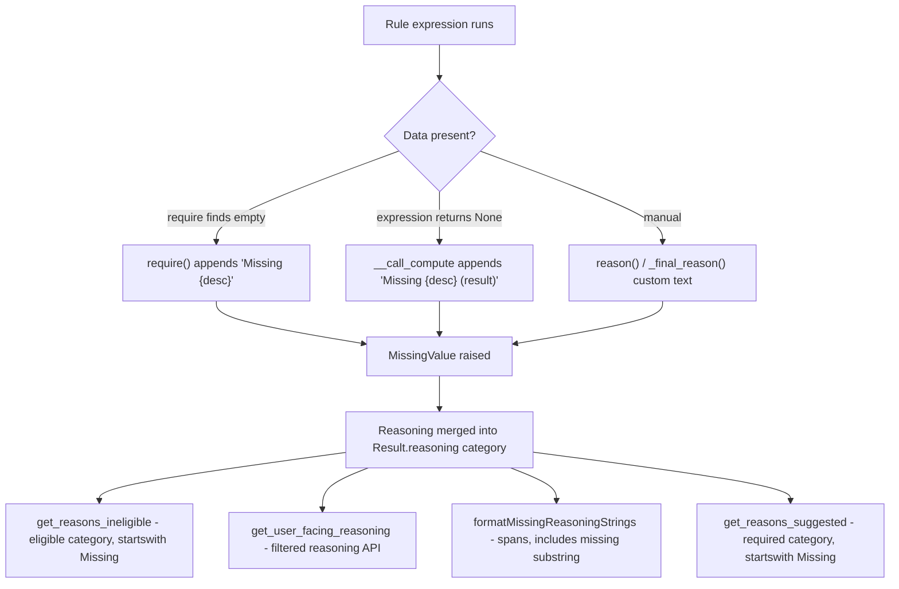

# PIE-120 Spike: Scope of Humanizing "Missing Data" Messages

## Research methodology

### Round 1 — Direct codebase investigation (initial spike)

The first pass was done inline (no subagents): reading `BaseRule`, the checks
framework, `results.py`, serializers, and frontend consumers; plus `rg`/shell
counts across `backend/benefits`.

### Round 2 — Parallel verification subagents (review-style complement)

Two explore subagents were spawned in parallel to verify and complement Round 1:

| Agent focus           | Scope                                                                                              | Outcome                                                                                                                                                                                   |
| --------------------- | -------------------------------------------------------------------------------------------------- | ----------------------------------------------------------------------------------------------------------------------------------------------------------------------------------------- |
| Backend verification  | `__init__.py` paths, counts, `require`/`Checkable` wiring, internal vs user-facing filters         | Confirmed all primary counts; **Checkable ctor calls: 486** (claimed 487, off by 1); found **7 additional `Requirement()` in `leaves/services/checks/`** outside `benefits/rules/checks/` |
| Frontend verification | `formatMissingReasoningStrings`, `reasonsIneligible`, `suggestedBenefits.ts`, document passthrough | Confirmed only **2 production sites** use `.includes('missing')` on spans; `missing_data` on `IBenefitResultVM` is **typed but unused**                                                   |

No further review rounds were run after subagent verification (no disagreements
requiring reconciliation beyond the Checkable −1 count).

---

## Executive summary

Missing-data messages are generated centrally in `BaseRule`
(`backend/benefits/rules/__init__.py`) and flow through reasoning into
user-facing surfaces (`reasons_ineligible`, benefit explainability UI, document
suggestions). A **framework-level change** to `require()` and the `(result)`
None path can update message _format_ for all rule types (benefit and document),
but **human-readable _content_ still requires updating descriptions** across the
checks layer and ~46 state/document rule files.

**Estimated touch surface:**

| Layer                        | Items                                                                          | Notes                                                                                                               |
| ---------------------------- | ------------------------------------------------------------------------------ | ------------------------------------------------------------------------------------------------------------------- |
| Framework (`__init__.py`)    | 4 code paths                                                                   | `require()`, None `(result)`, `get_result_for()`, schedule helper                                                   |
| Checks `Requirement.desc`    | ~75 instances (68 in `benefits/rules/checks/`, 7 in `leaves/services/checks/`) | Drives ~486 `Checkable` ctor usages automatically                                                                   |
| Direct `require()` in rules  | ~274 prod calls in ~46 files                                                   | ~26 calls lack explicit `description=`                                                                              |
| Downstream consumers         | 3 backend + 2 frontend                                                         | `get_reasons_ineligible`, document `reasons_suggested`, `formatMissingReasoningStrings`, `formatMissingSpanReasons` |
| Tests asserting `"Missing "` | ~30 backend files                                                              | Mass string updates expected                                                                                        |

---

## Architecture: where "Missing" messages come from



### Code paths in `backend/benefits/rules/__init__.py`

| Lines | Pattern                                  | Trigger                                                                    |
| ----- | ---------------------------------------- | -------------------------------------------------------------------------- |
| ~593  | `Missing {self.__description} (result)`  | Callable expression returns `None` (and `__final_reason` not set)          |
| ~742  | `Missing {description}{extra}`           | `require()` finds empty value; `extra` = `(variable N)` when multiple args |
| ~1055 | `Missing result for {rule_name}`         | `get_result_for()` finds no dependency result                              |
| ~3769 | `Missing schedule time including {date}` | `get_schedule_block()` finds no schedule block                             |

**Related (raises `MissingValue` without new `"Missing"` text):**

- `_eval_expression` catches `MissingValue`; child reasoning already recorded
  (~660)
- `and_expressions` / `or_expressions` propagate missing state (~949–1002)
- `BaseDocumentRule.suggest()` uses `_final_reason("Suggested: …")` then raises
  `MissingValue` (~4072–4075)

### `require()`, `requires()`, `Requirement`, `Checkable`

```
Requirement(value, desc)          # dataclass (__init__.py ~4187)
        ↓
requires(*reqs)                     # loops → require(req.value, description=req.desc) (~701)
        ↓
require(*vars, description=…)       # empty check → "Missing {description}" + MissingValue (~707)

Checkable(func, *args)              # checks/base.py
  __call__(rule, leave):
    check = func(...)
    rule.describe(check.desc, check.desc_false)
    rule.requires(*check.reqs)
    return check.result()
```

- **You do not need to visit every `requires()` call site.** Updating
  `Requirement.desc` in check functions updates all
  `Checkable`/`NegatedCheckable` consumers.
- Production `requires()` outside the descriptor: one manual call in
  `new_jersey/fla.py`; the rest are in `checks/base.py` and tests.

### Rule type coverage

Both `BaseBenefitRule` and `BaseDocumentRule` inherit `BaseRule.require()` /
`requires()`. Example: `NonFMLAMedCert` produces `"Missing published paycalc"`
via `Checkable(paycalc.has_any_item, …)` →
`Requirement(…, "published paycalc")`.

### Checks modules with `Requirement` definitions

| File                                        | `Requirement(` count |
| ------------------------------------------- | -------------------- |
| `backend/benefits/rules/checks/employee.py` | 19                   |
| `backend/benefits/rules/checks/leave.py`    | 13                   |
| `backend/benefits/rules/checks/paycalc.py`  | 4                    |
| `backend/benefits/rules/checks/benefit.py`  | 3                    |
| `backend/benefits/rules/checks/schedule.py` | 2                    |

Also: `backend/benefits/rules/checks/company.py` uses `Requirement.get()` (4
call sites).\
`dependent.py` does **not** use `Requirement` (uses `get_result_for()` instead).

Additional: **7 `Requirement()` in `leaves/services/checks/`** (outside benefits
checks tree).

---

## Spike questions — answers

### Q1: This is on an exception handler path; can we assume there is no case where we do not want to add reasoning visible to end users?

**No — not universally.**

`MissingValue` is control-flow for “expression could not be evaluated,” not
strictly “show this to the user.” Reasoning appended before the exception is
stored in `Result.reasoning` and may or may not reach end users depending on
category and filtering.

**User-facing paths (must be humanized):**

| Consumer                                               | Source category      | Detection                                                         |
| ------------------------------------------------------ | -------------------- | ----------------------------------------------------------------- |
| `get_reasons_ineligible()`                             | `reasoning.eligible` | `passed is None` and `startswith("Missing ")` (among other rules) |
| `get_user_facing_reasoning()`                          | most categories      | Filtered but preserves most eligible/awake/spans messages         |
| `formatMissingReasoningStrings()`                      | `reasoning.spans`    | `.toLowerCase().includes('missing')`                              |
| `formatMissingSpanReasons()` / `getNotAppliedReason()` | `reasoning.spans`    | Same substring filter (step 3 of priority chain)                  |
| `get_reasons_suggested()`                              | `reasoning.required` | `startswith("Missing")` or `startswith("Suggested: ")`            |

**Cases that are NOT purely end-user messaging:**

| Message / mechanism                                               | Why internal or special                                                                                 |
| ----------------------------------------------------------------- | ------------------------------------------------------------------------------------------------------- |
| `Missing result for {RuleName}`                                   | Dependency debug; class names are internal                                                              |
| `Missing approval_document_config`                                | In `INTERNAL_MESSAGE_PATTERNS`; category dropped entirely                                               |
| `Found result for …` / flag rollout strings                       | Filtered by `get_user_facing_reasoning()`                                                               |
| `_final_reason("Deferred to benefit template")` etc.              | Internal span/paycalc semantics                                                                         |
| `Missing definitive FMLA eligibility when 50/75 rule is enforced` | Intentional via `_final_reason()` in `checks/company.py`                                                |
| `get_reasons_ineligible` scope                                    | Only reads `eligible` — missing data in `awake`/`spans`/`required` does not become `reasons_ineligible` |

**Recommendation:** Treat `require()` and `(result)` paths as **intended
user-facing by default**, but audit non-`require()` `Missing*` messages
(`get_result_for`, schedule helpers, `_final_reason`). Some should be humanized;
some should be reclassified as internal and filtered consistently.

---

### Q2: Must we visit every `requires()` call and every `Requirement`? Or can unvisited cases keep legacy format while visited cases specify complete messages?

**Hybrid model — framework change is global; content updates are selective but
incomplete coverage leaves bad fallbacks.**

| Approach                                                     | What happens for unvisited cases                                                                                              |
| ------------------------------------------------------------ | ----------------------------------------------------------------------------------------------------------------------------- |
| **Framework-only** (change `require()` format string)        | New suffix with **old bad descriptions**: e.g. `"expected_due_date has not been provided."` — still fails acceptance criteria |
| **Checks-only** (update `Requirement.desc` in `checks/*.py`) | Fixes ~486 `Checkable` paths; does **not** fix direct `require()` in ~46 state/document rule files                            |
| **Full coverage**                                            | Framework + checks + direct `require()` descriptions + `(result)` `describe()` strings                                        |

**Fallback behavior today:**

```python
# require() — if description is blank, falls back to expression __description
if not description or not description.strip():
    description = self.__description  # often the Python function name
```

Evidence: `test_base_classes.py` — `require("", description=" ")` produces
`"Missing blank_require_description"`.

**`Requirement` without `desc`:** Falls through to the check’s `desc` (the
eligibility question, not the missing-field label). Example:
`Requirement(leave.leave_type)` → if missing, message may be an eligibility
sentence, not a missing-field label.

**Verified counts:**

| Metric                                             | Count | Notes                                                     |
| -------------------------------------------------- | ----- | --------------------------------------------------------- |
| `.require(` (all backend/benefits, incl. tests)    | 284   |                                                           |
| `.require(` (prod, excl. tests)                    | 274   |                                                           |
| `.requires(` (all)                                 | 10    | Only 3 prod (2× `checks/base.py`, 1× `new_jersey/fla.py`) |
| `Requirement(` (excl. tests)                       | 75    | 68 in `benefits/rules/`, 7 in `leaves/services/checks/`   |
| `Checkable(` ctor calls (excl. tests)              | 486   | Spike initially said 487 (−1)                             |
| `NegatedCheckable(` (excl. tests)                  | 17    |                                                           |
| Direct `.require(` in rule files outside `checks/` | 46    | 47 if `__init__.py` included                              |
| `.require()` without `description=` (prod)         | 26    | Fall back to `describe()` / function name                 |

**Recommendation (Option A from ticket, refined):**

1. Change format in `require()` and `(result)` path centrally.
2. Update all `Requirement.desc` values in checks modules (+
   `leaves/services/checks/` if in scope).
3. Audit direct `require()` in **~46 rule files**.
4. Add `desc` to `Requirement.get()` calls missing it.
5. **Do not** need to touch individual `requires()` call sites.

Unvisited cases will **not** retain the old `"Missing "` prefix if the framework
changes — they get the new format with poor descriptions unless caught by
validation.

---

### Q3: Will implementation require callers to provide a custom description? How do we ensure unit tests cover all requirements?

**Custom descriptions are effectively required for acceptable UX**, but the
framework does not enforce them today (except `RuleDefinitionError` when both
`description` and `__description` are empty).

**With proposed format `{description} has not been provided.`:**

- Good: `Requirement(leave.expected_due_date, "The expected due date")` →
  `"The expected due date has not been provided."`
- Bad: `self.require(leave.expected_due_date)` →
  `"some_method_name has not been provided."`
- Bad: `Requirement(leave.historical_profile.working_state)` with no desc → uses
  check `desc` (eligibility wording)

**Current test coverage gaps:**

- No repo-wide test that every `require()` has a human `description`.
- `test_plain_language_reasoning.py` only asserts no `= True/False` suffix.
- Many rule tests assert exact `"Missing …"` strings (~30 files).
- `DEBUG` enforces `desc_false` on `Check` / `NegatedCheckable`; **no equivalent
  for `Requirement.desc`**.

**Recommended guardrails:**

1. **DEBUG-time validation** on `Requirement.desc` (mirror `Check` pattern).
2. **Static audit script** (CI optional): `.require(` without `description=`,
   single-arg `Requirement(`, `Requirement.get(` without `desc`.
3. Update `get_reasons_ineligible` tests for new detection logic.
4. Extend `test_missing_data` pattern from `checks/tests/test_employee.py` to
   other check modules.
5. Do **not** rely on visiting every rule unit test — use checks-layer tests +
   spot-check high-traffic rules from the rewrite table.

---

### Q4: Will `formatMissingReasoningStrings()` need an alternative way to recognize missing-data reasoning?

**Yes — if the `"Missing "` prefix is removed, both backend and frontend
detection must change.**

**Current detection:**

| Consumer                        | File                                         | Logic                                               |
| ------------------------------- | -------------------------------------------- | --------------------------------------------------- |
| `get_reasons_ineligible`        | `backend/benefits/services/results.py`       | `text.startswith("Missing ")` when `passed is None` |
| `formatMissingReasoningStrings` | `EligibleBenefitsSection.tsx`                | `reasoning.spans` where `.includes('missing')`      |
| `formatMissingSpanReasons`      | `frontend/client/utils/suggestedBenefits.ts` | Same substring on spans                             |
| `get_reasons_suggested`         | `backend/documents/serializers.py`           | `startswith("Missing")` on `reasoning.required`     |
| `_normalize_ineligible_reason`  | `results.py`                                 | Strips `(variable N)` suffix                        |

**Frontend nuance (verified):**

- `formatMissingReasoningStrings` reads **`reasoning.spans` only**, not
  `reasonsIneligible`.
- Missing data in **`reasoning.eligible`** → API `reasonsIneligible` →
  ineligible / Not Applied UI.
- Missing data in **`reasoning.spans`** → Admin PDP yellow “Missing
  Requirements” tooltip (when explainability flag on and no paycalc items).
- `IBenefitResultVM.missing_data` exists in types but is **never read** in UI
  logic.

**Breakage if prefix removed:**

| Backend change                                    | `formatMissingReasoningStrings`                                           |
| ------------------------------------------------- | ------------------------------------------------------------------------- |
| Reword without substring `"missing"`              | Returns `[]` → yellow tooltip hidden; falls through to `EmptySpanTooltip` |
| Move messages to `eligible` / `reasonsIneligible` | Eligible-section tooltip lost; ineligible paths still show text           |
| Keep word `"missing"` somewhere in message        | Substring match still works (fragile)                                     |

**Recommended approach (pick one for implementation):**

| Option                                                                                               | Pros                           | Cons                                             |
| ---------------------------------------------------------------------------------------------------- | ------------------------------ | ------------------------------------------------ |
| **A. Structured reasoning** — `ReasoningEntry` with `kind="missing_data"` or use `missing_data` flag | Clean; works across categories | Larger change; serializer + frontend types       |
| **B. New prefix** — e.g. dual-match during migration                                                 | Smaller diff                   | Still stringly-typed                             |
| **C. Use `reasonsIneligible` in eligible-section tooltip**                                           | Aligns with API                | UI behavior change; spans-only cases need review |

**Minimum for PIE-120:** Update `get_reasons_ineligible`,
`get_reasons_suggested`, `formatMissingReasoningStrings`, and
`formatMissingSpanReasons` to use structured signals or an agreed sentence
pattern — **not** substring `"missing"`.

---

## Proposed implementation scope (for pointing)

### Phase 1 — Framework (1–2 days)

- [ ] `BaseRule.require()`: new message format; remove `(variable N)` suffix (or
      consolidate multi-var per ticket notes)
- [ ] `BaseRule.__call_compute()`: humanize `(result)` path
- [ ] `get_reasons_ineligible()`: new detection + normalization
- [ ] `documents/serializers.get_reasons_suggested()`: update `Missing` keyword
      logic
- [ ] Update `backend/benefits/services/tests/test_results.py`,
      `backend/benefits/tests/test_serializers.py`

### Phase 2 — Checks layer (2–3 days)

- [ ] `checks/employee.py`, `leave.py`, `paycalc.py`, `benefit.py`,
      `schedule.py`, `company.py`
- [ ] Add `desc` to all `Requirement` / `Requirement.get` without one
- [ ] Decide if `leaves/services/checks/` (7 `Requirement`) is in scope
- [ ] Review `checks/messages.py` for shared phrasing

### Phase 3 — Direct rule `require()` audit (3–5 days)

**46 files** with direct `require()` outside checks/tests. Priority:

1. **26 calls without `description=`**
2. Snake_case / EE jargon per rewrite table
3. Document rules (`documents/*.py`, `documents/__init__.py`)

### Phase 4 — Frontend (0.5–1 day)

- [ ] `EligibleBenefitsSection.tsx` — `formatMissingReasoningStrings`
- [ ] `suggestedBenefits.ts` — `formatMissingSpanReasons` /
      `getNotAppliedReason`
- [ ] Wire `missing_data` on `IBenefitResultVM` if backend sets it
- [ ] Update mocks/tests referencing `"Missing "` in reasoning

### Phase 5 — Guardrails (0.5 day)

- [ ] DEBUG validation for `Requirement.desc`
- [ ] Optional CI grep for unlabeled `require()` calls

### Out of scope / follow-ups

- `get_result_for()` → `"Missing result for RuleName"`
- `Missing schedule time including {iso-date}`
- Rules Builder `missing_data_point` catalog (engineering gaps, not runtime
  messages)
- Consolidating duplicate messages across states (nice-to-have in Phase 3)

---

## Acceptance criteria mapping

| Criterion                              | Primary work                            |
| -------------------------------------- | --------------------------------------- |
| No internal variable names in messages | Phase 2 + 3 description rewrites        |
| No `"EE"` abbreviation                 | Phase 2 + 3                             |
| Complete sentences                     | Phase 1 format + Phase 2/3 content      |
| Consolidate duplicates                 | Phase 2 shared messages + Phase 3 dedup |
| `get_reasons_ineligible()` still works | Phase 1                                 |
| No `(variable N)` suffixes             | Phase 1 `require()`                     |

---

## Key file reference

```
backend/benefits/rules/__init__.py          # BaseRule.require(), __call_compute(), Requirement
backend/benefits/rules/checks/base.py       # Checkable → requires()
backend/benefits/services/results.py        # get_reasons_ineligible, get_user_facing_reasoning
backend/benefits/serializers.py             # exposes reasons_ineligible + reasoning
backend/documents/serializers.py            # get_reasons_suggested
frontend/client/screens/Admin/PlanDetailsPage/Sidebar/PlanBenefitsCard/EligibleBenefitsSection/EligibleBenefitsSection.tsx
frontend/client/utils/suggestedBenefits.ts  # formatMissingSpanReasons, getNotAppliedReason
```

---

## Decisions needed before implementation

1. Structured `ReasoningEntry.kind` / `missing_data` flag vs. string pattern
   matching for consumers?
2. Should `formatMissingReasoningStrings` switch to `reasonsIneligible` or
   `missing_data`?
3. Are `get_result_for` / schedule `"Missing …"` messages in scope for PIE-120
   or a follow-up?
4. DEBUG-time `Requirement.desc` enforcement — error or warning?
5. Is `leaves/services/checks/` in scope for the same `Requirement.desc` pass?

---

## Recommendation for PIE-120 pointing

**Size:** Medium-large, backend-heavy (~1–1.5 weeks) with a small frontend
follow-up.

**Strategy:** Option A (update descriptions + central format change), not Option
B (centralized field-name mapping) — the checks framework already centralizes
most paths via `Requirement.desc`; a mapping layer would duplicate that and miss
direct `require()` calls.

---

_Spike and verification performed against `tilt-repo`, September 2026._
