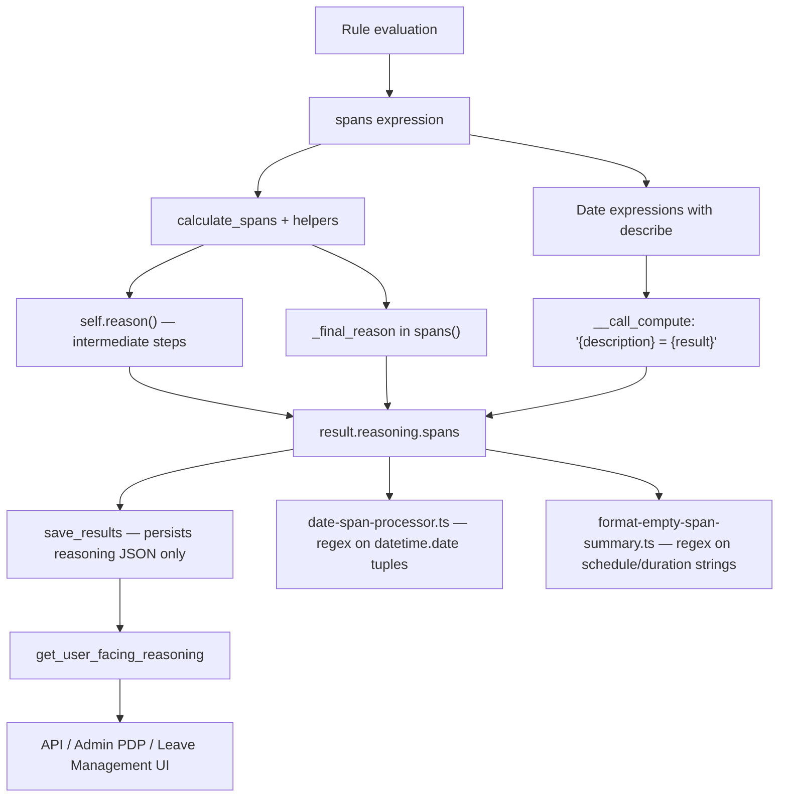

# Humanize Span Calculation Messages — Audit & Implementation Plan

## Status: NOT DONE — proceed with implementation

**Audit date:** 2026-09-08\
**Related work:** PIE-120 (missing-data messages) — separate ticket, overlapping
frontend (`'missing'` substring detection)\
**Dependency:** Date formatting (Ticket 5) — **partially exists** as
`format_leave_date()` in `backend/benefits/rules/checks/messages.py`\
**Readiness:** 8/10 for Phase 0–1; resolve structured-spans persistence before
PR 2 merges

---

## Executive summary

`reasoning.spans` is the largest and most technical category of benefit
reasoning. Today it exposes raw Python (`datetime.date(...)`, `<Span (...)>`,
`0:00:00` timedeltas, class names) and developer shorthand
(`CFRA eligible date = [...]`). **This rewrite has not been implemented.**

The highest-volume output path is still:

```python
# backend/benefits/rules/__init__.py:2225
self._final_reason(f"{self.description} = {spans}")
```

A parallel path exists in `backend/benefits/rules/wages.py:50` — same message
shape but uses **`self.reason()`**, not `_final_reason()`. Consider switching
wages to `_final_reason()` for parity and to avoid duplicate `__call_compute`
auto-append.

Partial groundwork exists (see below) but acceptance criteria from the ticket
are **not met**.

---

## Audit: what exists today

### Already in place (reuse, do not rebuild)

| Asset                         | Location                       | Notes                                                                         |
| ----------------------------- | ------------------------------ | ----------------------------------------------------------------------------- |
| `format_leave_date()`         | `checks/messages.py:241`       | Django `date_format(value, "F j, Y")` → `"October 10, 2023"`                  |
| `ReasoningEntry`              | `benefits/rules/reasoning.py`  | Structured `{text, passed}` storage; `date-span-processor` already handles it |
| `get_user_facing_reasoning()` | `benefits/services/results.py` | Filters internal debug strings; **does not** fix span formatting              |
| `INTERNAL_MESSAGE_PATTERNS`   | `results.py:13–28`             | Filters company-policy debug; raw `spans = (<Span ...>)` still passes through |
| PIE-120 spike docs            | `ai-docs/spikes/PIE-120-*.md`  | Phased rollout pattern                                                        |

### Not in place (ticket scope)

| Gap                                               | Evidence                                                                                  |
| ------------------------------------------------- | ----------------------------------------------------------------------------------------- |
| No `format_span()` / `format_span_list()` helpers | `rg format_span` → no matches in benefits                                                 |
| No humanized span final reason                    | `test_results.py:98` expects `spans = (<Span (2024-01-01, 2024-01-31)>,)` after filtering |
| Raw isoformat dates in reasons                    | `get_min_start_date`, `calculate_spans`, `california/utils.py`, etc.                      |
| Python class names in messages                    | `oregon/fla.py:104` (`OregonPLOPaid.__name__`); `__init__.py:3775` (`rule.__name__`)      |
| Sentinel dates shown to users                     | `test_base_classes.py:1004` expects `"Minimum effective date 0001-01-01"`                 |
| Timedelta `0:00:00` in messages                   | `get_max_duration` → `self.reason(f"Maximum duration {max_duration}")`                    |
| Law abbreviations not expanded                    | `describe("CFRA eligible date")` → `CFRA eligible date = [...]` via `__call_compute`      |

### Ticket analytics vs. current code

Some high-volume templates from the ticket **no longer exist verbatim** (e.g.
`"Intermittent spans consisting of up to 12 increments"`). Treat the ticket
table as **intent + message inventory**, not a literal grep checklist.

---

## Architecture: how span reasoning is produced



### Three message sources to fix

1. **`_final_reason` in `spans()`** (~46k+ prod analytics) — primary
   approved-period output.
2. **`__call_compute` auto-append** (`__init__.py:622`) —
   `{describe_label} = {result}` for non-bool expressions.
3. **Manual `self.reason()` calls** — **299** total across
   `backend/benefits/rules/**/*.py` (~100–120 span-related).

### Additional choke points

| Location                               | Mechanism                                              | Notes                                        |
| -------------------------------------- | ------------------------------------------------------ | -------------------------------------------- |
| `_validate_spans` (`__init__.py:1946`) | `result.reasoning.setdefault("spans", []).append(...)` | Bypasses `reason()`; must use same formatter |
| `wages.py:50`                          | `self.reason(f"{desc} = {spans}")`                     | Not `_final_reason`; see executive summary   |
| `checks/employee.py:620–627`           | `rule.reason()` with raw dates                         | Tenure/eligibility adjacent                  |
| `checks/dependent.py`                  | 4× `rule.reason()`                                     | Already plain language                       |

### `describe()` labels driving 7B messages

Central formatting via `format_expression_result()` + label map. Full inventory:

| File                    | describe() label                                                |
| ----------------------- | --------------------------------------------------------------- |
| `california/cfra.py`    | `CFRA eligible date`                                            |
| `fmla.py`               | `FMLA eligible date`                                            |
| `colorado/fca.py`       | `CO FCA eligible date`                                          |
| `california/pfl.py`     | `PFL minimum start date`                                        |
| `oregon/fla.py`         | `FLA dependent start date`                                      |
| `washington/pfml.py`    | `Washington PFML eligible date`                                 |
| `washington/pfml.py`    | `WA PFML family bank dependent start date`                      |
| `delaware/pfml.py`      | `Delaware PFML job protection eligible date`                    |
| `wisconsin/fmla.py`     | `WI FMLA eligible date`, `WI FMLA Bonding dependent start date` |
| `dc/fmla.py`            | `DC FMLA eligible date`, `DC FMLA Family dependent start date`  |
| `new_jersey/fla.py`     | `NJ FLA eligible date`                                          |
| `massachusetts/pfml.py` | `MA PFML family bank dependent start date`                      |
| `vermont/pfla.py`       | `VT PFLA eligible date`                                         |
| `company_policy.py`     | Continuous / intermittent span labels                           |

---

## Critical frontend coupling (must not break)

### 1. `date-span-processor.ts` — multi-span paycalc split

Parses `reasoning.spans` with regex `/([0-9]{4}),([0-9]{1,2}),([0-9]{1,2})/g`
looking for `datetime.date(2023, 11, 22)` tuples.

**Used by:** `useProcessedBenefits`, `EligibleBenefitsSection`,
`BenefitsComparisonModal`, `FlyoutContent`, test utils.

### 2. `format-empty-span-summary.ts` — empty-span tooltips

**Tighter coupling than date-span-processor.** Regex-matches exact backend
strings:

| Pattern                                                                      | Used for                                   |
| ---------------------------------------------------------------------------- | ------------------------------------------ |
| `^spans = \[`                                                                | Filters raw span dump from tooltip details |
| `No leave schedule overlaps this benefit's earliest start date (YYYY-MM-DD)` | Headline aggregation                       |
| `Schedule block falls before...`                                             | Skip-line headlines                        |
| `Max Duration exceeded` + `Maximum duration 0`                               | "No benefit time remaining" headline       |
| `No applicable leave schedules`                                              | Schedule-unavailable headline              |

**Phase 2 message rewrites MUST update this module +
`format-empty-span-summary.test.ts` in the same PR.**

### 3. Missing-data detection (PIE-120 overlap)

| File                          | Detection                                   |
| ----------------------------- | ------------------------------------------- |
| `EligibleBenefitsSection.tsx` | `.includes('missing')` on spans             |
| `suggestedBenefits.ts`        | `formatMissingSpanReasons` — same substring |

Coordinate with PIE-120 if span missing-data copy changes.

### 4. Mocks with hardcoded tuple strings

- `frontend/client/__mocks__/AdminPDP/benefitData.ts`
- Related test fixtures

---

## Structured spans persistence (resolve before PR 2)

**Problem:** `BenefitResult.spans` exists at evaluation time, but `Result` model
persists only `reasoning` JSON — no `spans` column. `save_results()`
(`services/rules.py:215–229`) writes `reasoning` only.

**Recommended approach (Option A):**

1. Add `Result.spans = JSONField(null=True)` — migration storing
   `[{"start": "2023-10-10", "end": "2023-12-04"}, ...]`.
2. Populate in `save_results()` from `BenefitResult.spans` when
   `not result.contains_unknown_span`.
3. Expose via `ResultSerializer.get_spans()` as ISO date objects.
4. Frontend `processDateSpansCallback` prefers `result.spans`; regex fallback
   for historical rows where `spans` is null.

**Fallback if migration deferred:** Derive from
`paycalc_items.from_field`/`to_field` at serialize time — only works when
paycalcs exist.

**Historical JSON:** Forward-only humanization; no backfill of stored
`reasoning` blobs required. Old leaves keep raw tuples in DB but new evaluations
overwrite on re-run.

---

## Implementation plan

### Phase 0 — Utilities module

**New file:** `backend/benefits/rules/reasoning_format.py`

```python
format_leave_date(date) -> str              # import from checks.messages (PIE-120); do not duplicate
format_leave_date_range(start, end) -> str
is_sentinel_date(date) -> bool
format_effective_date(date) -> str          # sentinel → "Not applicable"
format_duration(timedelta) -> str           # "105 days" not "105 days, 0:00:00"
days_to_weeks_phrase(days) -> str           # 42 → "6 weeks"
format_span(span) -> str
format_span_list(spans) -> str
expand_law_abbreviations(text: str) -> str  # expand all known abbrevs in one string
rule_display_name(rule) -> str              # use get_benefit().title / template title, not __name__
format_span_output_message(description, spans, *, contains_unknown=False) -> str
format_expression_result(description, result) -> str
should_suppress_reason(message: str) -> bool  # sentinel-date noise
```

**i18n convention:** Wrap new user-facing strings in `gettext as _` (match
`checks/messages.py`). Existing `self.reason("plain string")` call sites get
humanized English first; wrap when touching.

**UNKNOWN_SPAN handling** (`Span(date.min, date.min)`):

- `format_span_output_message` when `contains_unknown_span`:
  `"Leave periods could not be calculated from the available schedule data."`
  (do not format date.min).
- Sentinel suppression (`year < 1900`) must **not** suppress this unknown-span
  message.

**Abbreviation table** (`LAW_ABBREVIATIONS`):

| Abbr    | Full name                                         |
| ------- | ------------------------------------------------- |
| CFRA    | California Family Rights Act                      |
| FMLA    | Family and Medical Leave Act                      |
| CO FCA  | Colorado Family Care Act                          |
| PFL     | Paid Family Leave                                 |
| PDL     | Pregnancy Disability Leave                        |
| SDI     | State Disability Insurance                        |
| DBL     | Disability Benefits Law (New York)                |
| FLA     | Family Leave Act                                  |
| OFLA    | Oregon Family Leave Act                           |
| PFML    | Paid Family and Medical Leave                     |
| WI FMLA | Wisconsin Family and Medical Leave Act            |
| DC FMLA | District of Columbia Family and Medical Leave Act |
| NJ FLA  | New Jersey Family Leave Act                       |

**Tests:** `backend/benefits/rules/tests/test_reasoning_format.py` — pure unit
tests, no DB.

---

### Phase 1 — Framework choke points (highest ROI)

| Change                       | File                                      | What                                                                           |
| ---------------------------- | ----------------------------------------- | ------------------------------------------------------------------------------ |
| Span final output            | `__init__.py:2225`                        | `_final_reason(format_span_output_message(...))`                               |
| Wages span output            | `wages.py:50`                             | `_final_reason(format_span_output_message(...))` — switch from `self.reason()` |
| Expression results           | `__init__.py:622`                         | `format_expression_result(desc, result)`                                       |
| Invalid spans                | `__init__.py:1946`                        | Humanize without raw Python repr                                               |
| Optional: suppress sentinels | `__init__.py:679` `reason()`              | Skip append when `should_suppress_reason()`                                    |
| DB + serializer              | `models.py`, `rules.py`, `serializers.py` | `Result.spans` JSONField + populate + expose                                   |
| Frontend processor           | `date-span-processor.ts`                  | Prefer `result.spans`; legacy regex fallback                                   |
| Types                        | `frontend/client/_types/index.ts`         | Add `spans?: {start, end}[]` to `IBenefitResultVM`                             |

**`format_span_output_message` behavior (7A):**

| Input                                 | Output                                                           |
| ------------------------------------- | ---------------------------------------------------------------- |
| empty / `[]`                          | `"No leave periods were calculated."`                            |
| 1 span                                | `"Approved leave period: October 10, 2023 to December 4, 2023."` |
| N spans                               | `"Approved leave periods:"` + one formatted range per line       |
| `description` contains "continuous"   | Prefix `"Continuous leave period:"`                              |
| `description` contains "intermittent" | Prefix `"Intermittent leave periods:"`                           |
| unknown span                          | See UNKNOWN_SPAN copy above                                      |

**PR 1 tests (in same PR):** `test_reasoning_format.py`, `test_results.py`,
`test_base_classes.py`, `test_wages.py`, `date-span-processor.test.ts`.

---

### Phase 2 — Base rule intermediate messages (`__init__.py` + filtering)

Rewrite `self.reason()` in span calculation paths. **Ship
`format-empty-span-summary.ts` updates in this PR.**

Subcategories 7C–7G from ticket (max duration, schedule, tenure, parental,
documents) — see ticket table. Key files: `calculate_spans` (~3613–3720),
`get_min_start_date`, `get_max_duration`,
`adjust_schedule_days_using_documents`.

**Sentinel dates:** Suppress at `reason()` time (don't append) rather than
rewrite.

**Filtering (`results.py`):** Update `INTERNAL_MESSAGE_PATTERNS` in same PR for
any messages that slip through. Update
`test_get_user_facing_reasoning_filters_company_policy_span_debug` to expect
humanized span line.

---

### Phase 3 — State-specific rule files

**299 total `self.reason()` calls.** High-priority files:

| File                    | Count            | Priority                                |
| ----------------------- | ---------------- | --------------------------------------- |
| `__init__.py`           | 36               | Done in Phase 2                         |
| `massachusetts/pfml.py` | 40               | High                                    |
| `washington/pfml.py`    | 31               | High                                    |
| `wisconsin/fmla.py`     | 19               | High                                    |
| `rhode_island/tdi.py`   | 14               | Medium                                  |
| `delaware/pfml.py`      | 13               | Medium                                  |
| `new_jersey/tdi.py`     | 13               | Medium                                  |
| `hawaii/tdi.py`         | 11               | Medium                                  |
| `minnesota/pfml.py`     | 10               | Medium                                  |
| `fmla.py`               | 9                | High                                    |
| `colorado/famli.py`     | 8                | Medium                                  |
| `dc/pfl.py`             | 8                | Medium                                  |
| `new_jersey/pfl.py`     | 8                | Medium                                  |
| `rhode_island/pfmla.py` | 8                | Medium                                  |
| `company_policy.py`     | 5                | Medium — user-facing timedelta messages |
| **~22 other files**     | **~82 combined** | Batch 3–5 files per PR                  |

**Shared pattern files:**

- `california/utils.py` — `get_dependent_start_date()` (uses rule name strings
  like `"CaliforniaSDI"`, not `__name__`)
- `oregon/fla.py` — `OregonPLOPaid.__name__` leak
- `wisconsin/fmla.py` — same `__name__` pattern
- `new_york/pfl.py` — DBL tenure messages
- `new_jersey/pfl.py` — `Global Bonding Period` isoformat messages

**`backend/legacy/fmla.py`:** No `reason()` calls — ticket reference is stale;
BKE FMLA is `benefits/rules/fmla.py`.

---

## Test matrix (by PR, not a separate phase)

| PR                              | Backend tests                                              | Frontend tests                      |
| ------------------------------- | ---------------------------------------------------------- | ----------------------------------- |
| 1 (helpers)                     | `test_reasoning_format.py`                                 | —                                   |
| 2 (framework)                   | `test_base_classes.py`, `test_results.py`, `test_wages.py` | `date-span-processor.test.ts`       |
| 3 (`__init__.py` intermediates) | Span reasoning assertions in `test_base_classes.py`        | `format-empty-span-summary.test.ts` |
| 4+ (state files)                | Per-file `result.reasoning["spans"]` updates               | Mocks if needed                     |

**Scope note:** 13 files contain `spans = (` literal; many more assert on
`result.reasoning["spans"]` across state suites.

**Do not** assert on `datetime.date(`, `<Span`, or `0:00:00` after this work.

---

## Acceptance criteria checklist

| Criterion                                                     | Phase   |
| ------------------------------------------------------------- | ------- |
| No `datetime.date(...)` in span messages                      | 0–1     |
| No `<Span ...>` or `<class '...'>` in messages                | 0–1, 3  |
| No `0:00:00` timedelta in messages                            | 0, 2    |
| Dates as `Month Day, Year`                                    | 0       |
| Law abbreviations expanded                                    | 0–1     |
| Leave types title case, not ALL CAPS                          | 2, 3    |
| Sentinel dates hidden or "Not applicable"                     | 0, 2    |
| Birth durations in weeks where specified                      | 0, 2, 3 |
| UNKNOWN_SPAN uses dedicated copy, not date.min                | 0–1     |
| Invalid spans message has no Python repr                      | 1       |
| `format-empty-span-summary` still produces sensible headlines | 2       |
| Historical persisted reasoning readable (forward-only OK)     | 1       |
| Intermediate debug noise filtered or suppressed               | 2       |

---

## Suggested PR slicing

1. **PR 1:** `reasoning_format.py` + unit tests only (no behavior change)
2. **PR 2:** Framework choke points + `Result.spans` migration + serializer +
   `date-span-processor.ts` + types
3. **PR 3:** `__init__.py` intermediate messages +
   `format-empty-span-summary.ts` + `results.py` filters
4. **PR 4+:** State files batched by region (3–5 files per PR)

---

## Session kickoff prompt

```
Implement humanized span calculation messages per:
  ai-docs/spikes/humanize-span-calculation-messages-scope.md

Phase 0 + Phase 1 only:

1. Create backend/benefits/rules/reasoning_format.py + test_reasoning_format.py
   - Reuse format_leave_date from checks/messages.py (import, don't duplicate)
   - Handle UNKNOWN_SPAN and sentinel dates per doc

2. Wire format_span_output_message:
   - __init__.py:2225 via _final_reason()
   - wages.py:50 via _final_reason() (switch from self.reason())
   - __init__.py:1946 invalid spans message

3. Wire format_expression_result into __call_compute (__init__.py:622)

4. Structured spans (Option A):
   - Add Result.spans JSONField + migration
   - Populate in RuleService.save_results() when not contains_unknown_span
   - Expose in ResultSerializer; add to IBenefitResultVM
   - Update date-span-processor.ts to prefer result.spans; keep regex fallback

5. Update tests:
   - test_results.py, test_base_classes.py, test_wages.py
   - date-span-processor.test.ts (add structured-spans cases)

Do NOT change state-specific files or format-empty-span-summary.ts yet (Phase 2).

Read .ai/README.md and testing standards.

Run:
  pytest backend/benefits/rules/tests/test_reasoning_format.py \
        backend/benefits/services/tests/test_results.py \
        backend/benefits/rules/tests/test_base_classes.py \
        backend/benefits/rules/tests/test_wages.py -q
  npm test -- date-span-processor

Acceptance: framework paths emit no datetime.date(, <Span, or 0:00:00 in reasoning.spans.
```

---

## Open decisions

| # | Question                                           | Recommendation                                                  |
| - | -------------------------------------------------- | --------------------------------------------------------------- |
| 1 | Move `format_leave_date` to `reasoning_format.py`? | **Import/re-export** from `checks/messages.py`; don't duplicate |
| 2 | Suppress vs. rewrite sentinel `reason()` calls?    | **Suppress** at `reason()`                                      |
| 3 | Structured spans persistence?                      | **`Result.spans` JSONField** (see above)                        |
| 4 | Backfill historical `reasoning` JSON?              | **Forward-only**; re-evaluation overwrites                      |
| 5 | PIE-120 coordination for `'missing'` detection?    | Note in PR; don't change substring logic in Phase 1             |
| 6 | Ticket ID                                          | Assign Jira key when created                                    |

---

## Research methodology

- **Round 1:** Direct codebase audit (grep, read core files, PIE-120 spikes).
- **Round 2:** Two parallel subagent reviews — codebase verification + plan
  handoff review. Corrections incorporated above (wages.py mechanism,
  format-empty-span-summary coupling, persistence gap, Phase 3 counts,
  UNKNOWN_SPAN, test matrix).
